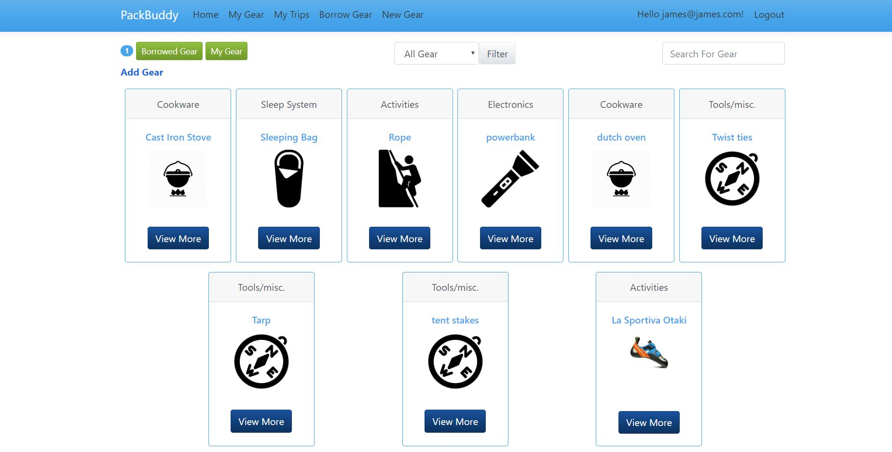
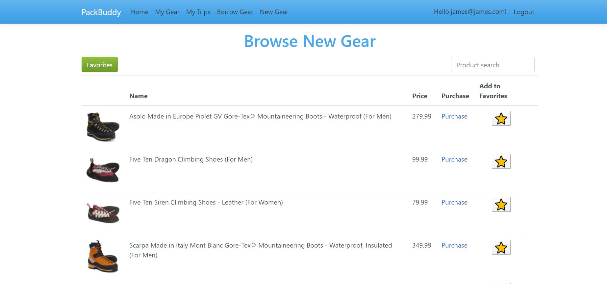

# Pack Buddy

Pack Buddy is a web-app designed for users to register all their camping gear/equipment and log all their trips along with the gear they brought. This app is designed to strengthen users packing skills by showing any forgotten necessities or superfluous additions to their pack. Additionally users can request to borrow gear from other users or find new gear from Sierra Trading Post.

Pack Buddy is an Asp.NetCore MVC web app with Entity and Identity Frameworks, Sierra Trading Post's API, and styling with Bootstrap and CSS

      

## Installation

From your terminal run git clone SSH KEY HERE

Open Visual Studio

Under the tools tab, open the NuGet Package Manager console and run Update-Database to run migrations

Build and run the application after migrations are complete

## Usage
1. Register a new user or sign into an existing account
2. Select 'My gear' from either the navigation bar or the homepage.
3. Log as many items as you like.
4. Click on an item's name to view more information. From this view you can edit or remove the item
5. Click on 'My Trips'
6. Select 'New Trip' and add your trip details
7. Select 'Start Packing' from the alert. Add any items from your pack with the checkbox.
8. View Trip details and choose to either update your pack or add notes. If a trip has ended users cannot update the pack
9. Select 'Borrow Gear' and search for other users emails. You can then select their gear and request to borrow it.
10. If a user has requested your gear the notification box will display the number of requests and click 'view' will allow you to confirm or deny requests
11. Select 'New Gear' to search through SierraTradingPosts online log of equipment
12. Items can be favorited and viewed by clicking the star icon and the selecting 'favorites'
